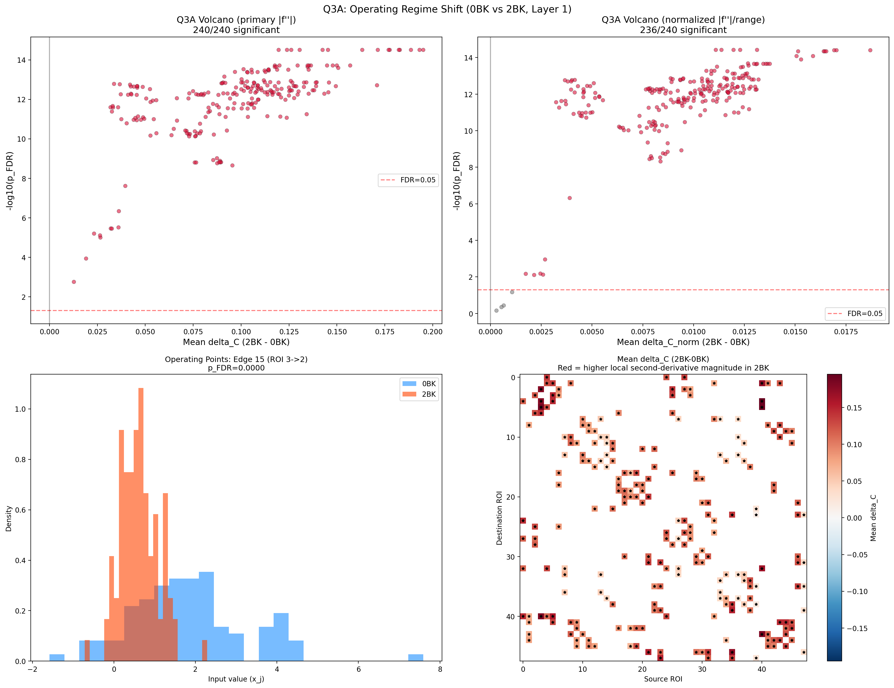
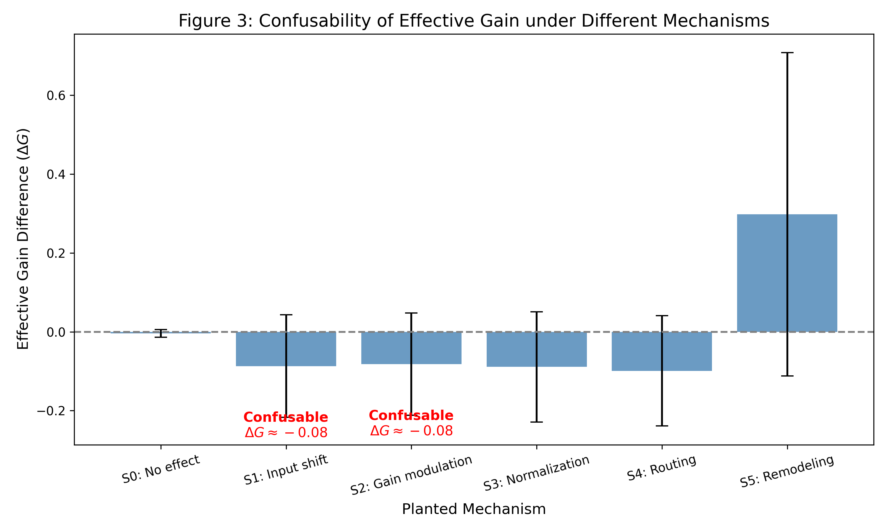

# BrainKAN Explainability: An Identifiability-Aware Framework for Evaluating Edge-Level Nonlinear Functions in Task-fMRI Graph Models

[](https://opensource.org/licenses/MIT)
[](https://www.python.org/downloads/)

**Status:** Independent research project / methodological study  
**Key finding:** 
- Under exploratory calibration (**Q3B**), **0 / 240** edges survived FDR correction, indicating that the apparent task-related curvature shifts in naive evaluations are heavily confounded by input-regime kinematic shifts.
- However, under held-out effective-gain comparison (**Q3C**), **11 / 240** edges showed statistically significant differences ($p_{\mathrm{FDR}} < 0.05$).
*Crucially, these two analyses target different estimands ($\boxed{ \text{naive curvature} \neq \text{common-reference structural} \neq \text{effective-gain} }$) and therefore should not be interpreted as contradictory evidence.*

This repository presents an identifiability-aware framework for probing edge-level nonlinear functions in task-fMRI graph models. Rather than treating learned nonlinearities as direct evidence of biological computation, we explicitly test when such interpretations are supported—and when they are confounded by condition-dependent input regimes.

By developing a common-reference and null-calibrated framework, this research codebase characterizes what aspects of edge-level computation can—and cannot—be identified under the tested task-fMRI setting.

## 🚀 Quick Start

### Environment
- Python 3.10+
- PyTorch (compatible with your CUDA version)
- See `requirements.txt` for full dependencies

### Dataset
Experiments were conducted using **HCP-YA working memory task fMRI data**. The analysis focused on 0-back vs 2-back conditions across a subset of 100 subjects. See `data/README.md` for required tensor formatting.

### Run
```bash
python 01_q1_q2_q3a_naive_analysis.py
```

---

## 🌟 The Core Scientific Narrative

```text
Scientific Question
────────────────────────────────────
Does a task-related change in regional activation imply a change in edge-level computation?
                  BrainKAN
                   │
                   ▼
        Explicit edge function Φij(x)
                   │
        ┌──────────┼──────────┐
        ▼          ▼          ▼
       Q1         Q2         Q3A
    Functions   Taxonomy   Curvature shift
                               │
                               ▼
                     Shuffled-label null
                               │
                               ▼
                Same effect without task labels
                               │
                               ▼
             NON-IDENTIFIABILITY OF NAIVE EFFECT
                               │
                               ▼
                  Common-reference Q3B
                               │
                               ▼
                         0 / 240 FDR
                               │
                               ▼
                  No detectable excess
                  structural geometry
                               │
                               ▼
                     Effective Gain Q3C
                               │
                               ▼
                   11 / 240 FDR Significant
                               │
                               ▼
                    Synthetic Calibration
                               │
                ┌──────────────┴──────────────┐
                ▼                             ▼
      What is identifiable?           What is confounded?
                │                             │
                └──────────────┬──────────────┘
                               ▼
                IDENTIFIABILITY BOUNDARY
```

## 📊 Predictive Adequacy Check

Before interpreting edge functions, we must ensure BrainKAN successfully captures task-related information. It demonstrates stable predictive signal under subject-level cross-validation (N=100 subjects × 2 conditions). We benchmarked BrainKAN against standard graph neural networks simply to ensure it is learning effectively:

| Model | Mean 5-Fold Accuracy | Parameters | Edge-level Interpretability |
|-------|---------------------|------------|-----------------------------|
| **GCN** | ~86.0% | ~2.5k | No (Node-level only) |
| **GAT** | ~90.0% | ~3.1k | Attention weights only |
| **BrainKAN** | **~93.0%** | **~590k** | **Explicit edge-level function** $\Phi_{ij}(x)$ |

*Note: The primary goal here is **not predictive supremacy**, but establishing predictive adequacy. The capacity gap (590k vs ~3k parameters) makes direct superiority claims unfair. BrainKAN achieves stable subject-level predictive performance sufficient to support downstream function probing.*

## 📂 Repository Code Structure

The code implements the current analysis protocol. We differentiate full-data exploratory calibration (Q3B) from held-out calibrated analysis (Q3C).

- **`01_q1_q2_q3a_naive_analysis.py`** 
  Establishes function existence (Q1) and tests for clustering/taxonomy (Q2, which prevents biological over-interpretation). Crucially, it demonstrates the initial discovery of "remodeling" via naive $\Delta C$ (Q3A) and implements the **Shuffled-Label Null** that exposes the identifiability limitation. 
  
  
  
- **`02_q3b_common_reference_geometry.py`** (Full-data Exploratory Null Calibration)
  Implements the Common-Reference geometry to remove input-shift bias, training 100 independent Null Models with Subject-Level label swaps on the full dataset pair configuration. Result: **0/240 edges survived FDR correction under the tested common-reference estimand.** No detectable task-associated excess geometry was found under this analysis.

- **`03_synthetic_identifiability_benchmark.py`** 
  A synthetic encoding environment (S0-S5) across varying SNRs. It provides the **empirical Confusability Matrix** used to characterize the tested estimator's identifiability limits. 
  
  
  
- **`04_q3c_effective_gain.py`** (Held-Out Calibrated Comparison)
  Implements the Effective Gain estimator using **Subject-level 5-fold cross-validation** and tests significance using **5,000 subject-level paired sign-flip randomizations**. Result: **11/240 edges survived FDR correction**, representing the subset of edges with detectable effective gain differences.

- **`models/`**
  Contains the `EdgeSpecificKANConv` and `BrainKAN` architectural code, utilizing perfectly unified `_b_spline_basis` evaluations to prevent numerical divergence across scales.

- **`utils_data_loading.py`** 
  Handles strict subject-level cross-validation and standardizes the common fMRI tensor pipeline.

## 🔬 Methodology & Statistical Rigor

We applied absolute methodological constraints to prevent false positives:
1. **Statistical Unit**: The atomic unit of inference is the **Subject**, protecting paired nested structures.
2. **Q3A Null Unification (Authoritative Null)**: We use **Within-Subject Label Swapping** (randomly swapping 0BK $\leftrightarrow$ 2BK per subject) to break task association while preserving topological covariance.
3. **Q3B Calibration Alignment**: Identical statistic $T = 1-R^2$ computed using identically structured full-data exploratory pipelines for $G^{real}$ and $G^{null}$.
4. **Q3C Exchangeability**: Evaluated using a Paired Sign-Flip test. This assumes exchangeability under the null by applying 5,000 random sign assignments to the observed model-derived paired differences ($dG_i^{real} - dG_i^{null}$), conditional on the observed test statistic.
5. **Handling Out-of-Range Domains**: `np.interp` silent clamping is strictly blocked; out-of-range evaluations map directly to `NaN` and are transparently excluded, preventing artificial flattenings of curvature.

## ⚖️ Limitations & Future Work

To ensure absolute clarity regarding the scope of this project:
- **Null Sample Size & Sign-Flipping**: Q3B currently operates on $R_{null}=100$ due to computational constraints. For Q3C, we employ 5,000 subject-level paired sign-flip randomizations. This tests if the paired difference is significantly non-zero conditional on the observed models, rather than empirically resampling the true null distribution via 5,000 full-model retraining permutations. Future work should attempt true retrain-permutations if computational budgets allow.
- **Synthetic Paradigm & Empiric Thresholds**: The S0-S5 synthetic framework currently probes baseline scales, shifts, and nonlinear `tanh` perturbations. Our Confusability Probability Matrix relies on a specific absolute difference threshold ($\tau=0.2$). This maps the empirical confusability under a specific spline estimator and scale, rather than asserting a universal boundary. Further expansion into complex asymmetrical nonlinearities is required.
- **Hidden Channel Permutation Symmetry**: Layer 1 expands single features to 16 hidden channels. While we average across channels to compute mean curvature or slope, the hidden channels themselves possess permutation symmetry. Demonstrating true channel-level function reproducibility across folds remains a critical neural network identifiability issue for future exploration.
- **Deviation-from-Linearity**: Our defined Nonlinearity (NL) metric ($1 - R^2$) acts as a *deviation-from-linearity* index. Since the baseline function includes a `SiLU` activation, an edge with a zero spline component is still technically nonlinear.
- **Architectural Novelty**: The focus of this codebase is entirely on **scientific identifiability**, not pushing state-of-the-art predictive accuracy. It relies on standard KAN structures to demonstrate fundamental mathematical constraints of edge-level explainability in task-fMRI.

## ⚠️ Final Interpretational Constraints

Through the lens of this repository, we explicitly restrict the scientific conclusions:
- **We DO NOT claim** BrainKAN discovers new, true biological "working memory mechanistic motifs."
- **We DO NOT claim** effective gain differences ($\Delta G$) necessarily represent synaptic gain modulation, since our Synthetic Benchmark proved it is inherently confusable with input-regime kinematic shifts.
- **We DO claim** that this codebase provides evidence for an **Identifiability Boundary**: demonstrating that, under the tested edge-level estimator and task-fMRI observation regime, apparent task-related nonlinear remodeling can be confounded by condition-dependent input operating regimes.
